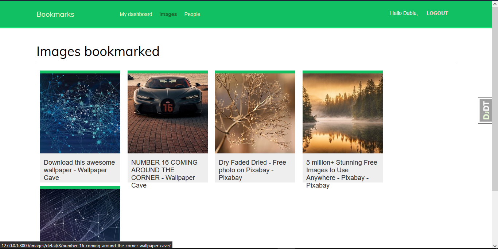

# Markr

A Django-powered bookmarking platform that lets users discover, save, and curate images with social interactions. Features seamless browser integration via bookmarklet, user authentication, image ranking, and activity tracking—all built on a solid foundation of Django best practices.



## Project Structure

**Core Apps**

- **account**: User authentication, registration, and profile management
- **images**: Image uploading, bookmarking, and ranking system
- **actions**: Activity tracking and user interactions

## Key Features

- User authentication and account management
- Image bookmarking and collection
- Social interactions (likes, rankings)
- Bookmarklet for quick saving from browser
- User detail and listing pages
- Password reset and change workflows

## Technology Stack

- **Framework**: Django
- **Database**: SQLite (db.sqlite3)
- **Frontend**: HTML templates with CSS styling
- **Static Assets**: JavaScript bookmarklet for browser integration

## Getting Started

- Create and activate virtualenv

```bash
pip install -r requiements.txt
python manage.py migrate
docker run -it --rm --name redis -p 6379:6379 redis
python manage.py runserver
```

## Project Notes

- Uses Django signals for async operations
- Organized media storage with date-based structure
- Environment configuration via `.env` file
- RESTful URL patterns across apps
